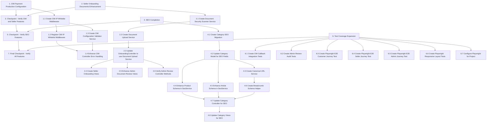

# Implementation Plan: Incomplete Features Completion

## Overview

This implementation plan covers the completion of four critical features for the MayushDesign Laravel marketplace: CMI Payment Production Configuration, Seller Onboarding Documents, SEO Completion, and Test Coverage Expansion.

The implementation builds upon existing code:
- `CmiController.php` - Hash validation and idempotency already implemented
- `OnboardingController.php` - Document upload workflow exists
- `SellerController.php` - Admin review methods exist
- `SeoService.php` - Schema generation implemented

## Tasks

- [x] 1. CMI Payment Production Configuration
  - [x] 1.1 Create CMI IP Whitelist Middleware
    - Create `app/Http/Middleware/CmiIpWhitelist.php`
    - Implement IP validation against `CMI_ALLOWED_IPS` configuration
    - Skip validation if whitelist is empty (backward compatible)
    - Log security events for rejected IPs
    - _Requirements: 1.3, 1.6_

  - [x] 1.2 Register CMI IP Whitelist Middleware
    - Add middleware alias in `app/Http/Kernel.php`
    - Apply middleware to CMI callback route in `routes/web.php`
    - _Requirements: 1.3_

  - [x] 1.3 Create CMI Configuration Validator Service
    - Create `app/Services/Payment/CmiConfigValidator.php`
    - Implement credential validation logic
    - Implement test mode detection
    - Implement gateway URL selection based on mode
    - _Requirements: 1.1, 1.2, 1.4, 1.5_

  - [x] 1.4 Enhance CMI Controller Error Handling
    - Update `CmiController.php` to use `CmiConfigValidator`
    - Add critical error logging for missing credentials
    - Return user-friendly error messages without exposing config
    - _Requirements: 1.2, 1.7_

  - [ ]* 1.5 Write unit tests for CMI IP Whitelist Middleware
    - **Property 1: IP Whitelist Enforcement**
    - **Validates: Requirements 1.3, 1.6**

  - [ ]* 1.6 Write unit tests for CMI Configuration Validator
    - Test valid/invalid credential detection
    - Test test mode vs production mode URL selection
    - _Requirements: 1.1, 1.4, 1.5_

- [ ] 2. Seller Onboarding Documents Enhancement
  - [-] 2.1 Create Document Security Scanner Service
    - Create `app/Services/Security/DocumentSecurityScanner.php`
    - Implement double extension detection
    - Implement embedded script detection in images
    - Implement MIME type verification against content
    - _Requirements: 5.1, 5.4_

  - [~] 2.2 Create Document Upload Service
    - Create `app/Services/Seller/DocumentUploadService.php`
    - Integrate `DocumentSecurityScanner` for security checks
    - Implement file type validation (PDF, JPEG, PNG, WEBP)
    - Implement file size validation (max 10MB)
    - Implement secure filename sanitization
    - _Requirements: 2.2_

  - [~] 2.3 Update OnboardingController to use Document Upload Service
    - Replace direct file storage with `DocumentUploadService`
    - Add detailed error messages for validation failures
    - Maintain existing workflow (upload, update status, notify admin)
    - _Requirements: 2.2, 2.4_

  - [~] 2.4 Create Seller Onboarding Views
    - Create/enhance `resources/views/seller/onboarding/index.blade.php`
    - Display upload form for each document type
    - Display existing documents with status
    - Display rejection reason if applicable
    - Display resubmission count and limit warning
    - _Requirements: 2.1, 2.5_

  - [~] 2.5 Enhance Admin Document Review Views
    - Create/enhance `resources/views/backend/sellers/documents_modal.blade.php`
    - Display all uploaded documents with download links
    - Add approve/reject form with reason field
    - Display resubmission count
    - _Requirements: 2.1.2_

  - [~] 2.6 Verify Admin Review Controller Methods
    - Verify `SellerController::showDocuments()` returns correct data
    - Verify `SellerController::approveApplication()` updates status and sends notification
    - Verify `SellerController::rejectApplication()` stores reason, increments count, sends notification
    - Add resubmission limit check to reject handling
    - _Requirements: 2.1.3, 2.1.4, 2.1.5_

  - [ ]* 2.7 Write unit tests for Document Security Scanner
    - **Property 4: Document Security Validation**
    - **Validates: Requirements 2.2, 5.1, 5.4**

  - [ ]* 2.8 Write unit tests for Document Upload Service
    - **Property 5: Document Type Validation**
    - **Validates: Requirements 2.2**

  - [ ]* 2.9 Write feature tests for Seller Document Workflow
    - Test document upload success
    - Test mandatory document completeness
    - Test resubmission limit enforcement
    - **Property 6: Mandatory Document Completeness**
    - **Property 7: Resubmission Limit Enforcement**
    - **Validates: Requirements 2.3, 2.1.5**

- [~] 3. Checkpoint - Verify CMI and Seller Features
  - Ensure all tests pass, ask the user if questions arise.

- [ ] 4. SEO Completion
  - [~] 4.1 Create Category SEO Migration
    - Create migration to add SEO columns to categories table
    - Add `meta_title`, `meta_description`, `meta_keywords`, `seo_description` columns
    - _Requirements: 3.1.1_

  - [~] 4.2 Update Category Model for SEO Fields
    - Add new SEO fields to `$fillable` array in `Category.php`
    - _Requirements: 3.1.1_

  - [~] 4.3 Create Canonical URL Service
    - Create `app/Services/Seo/CanonicalUrlService.php`
    - Implement canonical URL generation for category pages
    - Implement canonical URL generation for search pages
    - Remove filter query parameters from canonical URLs
    - _Requirements: 3.3, 3.4_

  - [~] 4.4 Enhance Product Schema in SeoService
    - Verify `SeoService::productSchema()` includes all required fields
    - Verify `aggregateRating` only included when reviews exist
    - Ensure brand field is populated
    - _Requirements: 3.1, 3.6_

  - [~] 4.5 Enhance Article Schema in SeoService
    - Verify `SeoService::articleSchema()` includes all required fields
    - Ensure author and publisher are correctly structured
    - _Requirements: 3.2_

  - [~] 4.6 Create Breadcrumb Schema Helper
    - Verify/enhance `SeoService::breadcrumbSchema()` method
    - Ensure proper hierarchy (Home > Category)
    - _Requirements: 3.1.3_

  - [~] 4.7 Update Category Controller for SEO
    - Update category controller to pass SEO fields to view
    - Render category `seo_description` in view
    - Include breadcrumb schema in category pages
    - _Requirements: 3.1.2, 3.1.3_

  - [~] 4.8 Update Category Views for SEO
    - Add canonical URL link tag
    - Add custom meta title/description/keywords
    - Display SEO description section above product grid
    - Handle empty category state with related categories
    - _Requirements: 3.1.2, 3.1.4_

  - [ ]* 4.9 Write unit tests for Canonical URL Service
    - **Property 10: Canonical URL Cleanliness**
    - **Validates: Requirements 3.3, 3.4**

  - [ ]* 4.10 Write unit tests for SEO Schema Generation
    - **Property 8: Product Schema Completeness**
    - **Property 9: Article Schema Completeness**
    - **Property 11: Breadcrumb Schema Hierarchy**
    - **Validates: Requirements 3.1, 3.2, 3.6, 3.1.3**

- [~] 5. Checkpoint - Verify SEO Features
  - Ensure all tests pass, ask the user if questions arise.

- [ ] 6. Test Coverage Expansion
  - [~] 6.1 Create CMI Callback Integration Tests
    - Create `tests/Integration/PaymentGateways/CmiCallbackIntegrationTest.php`
    - Test success callback with valid hash
    - Test failure callback with non-"00" ProcReturnCode
    - Test hash validation rejection
    - Test amount mismatch rejection
    - Test idempotency for duplicate transactions
    - **Property 2: Hash Validation Security**
    - **Property 3: Idempotent Callback Processing**
    - _Requirements: 4.1.1, 4.1.2, 4.1.3, 4.1.4, 4.1.5, 4.1.6_

  - [~] 6.2 Create Admin Review Audit Tests
    - Create `tests/Feature/Seller/AdminReviewAuditTest.php`
    - Test audit log creation on approval
    - Test audit log creation on rejection
    - Verify admin ID and timestamp in logs
    - **Property 12: Admin Review Audit Trail**
    - _Requirements: 5.3_

  - [~] 6.3 Create Playwright E2E Customer Journey Test
    - Create `tests/BrowserQa/CustomerJourneyTest.php`
    - Test homepage load
    - Test product search
    - Test product detail view
    - Test add to cart
    - Test checkout initiation
    - _Requirements: 4.2.1_

  - [~] 6.4 Create Playwright E2E Seller Journey Test
    - Create `tests/BrowserQa/SellerJourneyTest.php`
    - Test seller login
    - Test document upload page access
    - Test document upload
    - Test dashboard access after approval
    - _Requirements: 4.2.2_

  - [~] 6.5 Create Playwright E2E Admin Journey Test
    - Create `tests/BrowserQa/AdminJourneyTest.php`
    - Test admin login
    - Test seller review queue access
    - Test document viewing
    - Test approval workflow
    - Test rejection workflow with reason
    - _Requirements: 4.2.3_

  - [~] 6.6 Create Playwright Responsive Layout Tests
    - Create `tests/BrowserQa/ResponsiveLayoutTest.php`
    - Test mobile viewport (375px)
    - Test tablet viewport (768px)
    - Test desktop viewport (1280px)
    - Verify navigation menu functional on all viewports
    - Verify product cards render correctly
    - Verify checkout form is usable
    - _Requirements: 4.2.4_

  - [~] 6.7 Configure Playwright for Project
    - Create/update `playwright.config.ts`
    - Configure base URL
    - Configure viewports for responsive tests
    - Configure browsers (Chromium, Firefox, WebKit)
    - _Requirements: 4.1, 4.2_

- [~] 7. Final Checkpoint - Verify All Features
  - Ensure all tests pass, ask the user if questions arise.
  - Run full test suite including E2E tests
  - Verify CMI callback works with test credentials
  - Verify seller onboarding workflow end-to-end
  - Verify SEO schemas validate correctly

## Task Dependency Graph

## Notes

- Tasks marked with `*` are optional test tasks and can be skipped for faster MVP
- Each task references specific requirements for traceability
- Checkpoints ensure incremental validation
- Property tests validate universal correctness properties
- Unit tests validate specific examples and edge cases
- E2E tests validate full user journeys

## Implementation Priority

1. **Phase 1 - Security Critical**: Tasks 1.1-1.4 (CMI IP Whitelist) and 2.1-2.2 (Document Security)
2. **Phase 2 - Core Features**: Tasks 2.3-2.6 (Seller Onboarding), 4.1-4.8 (SEO)
3. **Phase 3 - Testing**: Tasks 6.1-6.7 (Test Coverage Expansion)
