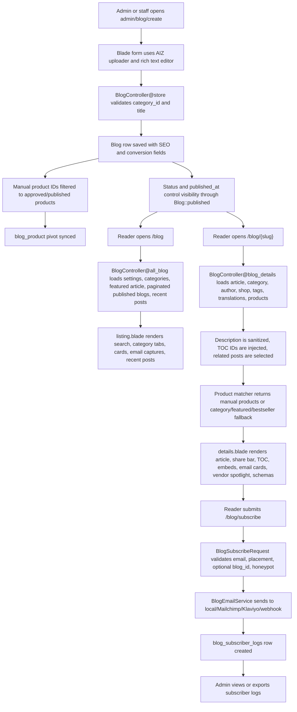

# Existing Blog System Operational Analysis

Date: 2026-06-03

## Executive Summary

The current blog system is a Laravel-native editorial-commerce module integrated into the broader Mayush marketplace. It uses the existing `Blog`, `BlogCategory`, `BlogTranslation`, `Tag`, `Product`, `Shop`, `Upload`, `BusinessSetting`, and Spatie permission patterns rather than a separate CMS.

The module supports public blog browsing, article details, translated article content, SEO metadata and JSON-LD, admin blog/category CRUD, publication toggles, product embeds, vendor spotlight blocks, table of contents generation, share links, email capture, subscriber exports, and provider integrations for local logging, Mailchimp, Klaviyo, and webhooks.

The strongest parts are reuse of existing marketplace architecture, focused integration tests, content sanitization, encrypted provider secrets, safe product filtering, and conversion-oriented reader UX. The main gaps are lack of a dedicated author workflow, no native comments, no content versioning, weak admin create/update validation, no database foreign keys, a likely production issue for lazy product loading because `/api/blog/products` still runs through `EnsureSystemKey`, raw SQL interpolation in blog search ordering, and a few settings/field mismatches.

## Architecture Map

### Core Stack

| Layer | Current implementation | Evidence |
|---|---|---|
| Backend framework | Laravel 10 on PHP `^8.2` | `composer.json`, `laravel/framework:^10.0` |
| Frontend rendering | Blade templates with the existing AIZ/Bootstrap-style theme, static scoped CSS and vanilla JS for blog conversion behavior | `resources/views/frontend/blog/*`, `public/assets/blog/css/blog-conversion.css`, `public/assets/blog/js/blog-conversion.js` |
| Database | Default Laravel `mysql` connection, with SQLite also supported for tests | `config/database.php` |
| Auth/session | Laravel web guard/session, encrypted sessions, secure/httpOnly/lax cookies | `config/session.php` |
| Authorization | `auth`, `admin`, and Spatie permission middleware | `routes/admin.php`, `app/Http/Middleware/IsAdmin.php`, `config/permission.php` |
| API | Laravel API route group with Sanctum stateful middleware, throttling, `EnsureSystemKey`, plus explicit endpoint throttles | `app/Http/Kernel.php`, `routes/api.php` |
| Media | Existing upload ID pattern via AIZ uploader; blog fields store upload IDs for banner, meta image, and hero image | backend blog create/edit views |
| Search | SQL `LIKE` search over title and short description; no full-text index for blogs | `BlogController::all_blog`, API V2 blog list |
| Caching | Business settings cache, product embed API cache by blog/category/placement/count | `BlogSettingsService`, `BlogApiController` |

### Third-Party Integrations

| Integration | Blog usage |
|---|---|
| Mailchimp | Email capture can upsert subscribers into a configured audience. API key is encrypted in `business_settings`. |
| Klaviyo | Email capture can submit profile subscription jobs. Private key is encrypted in `business_settings`. |
| Custom webhook | Email capture can POST subscriber payloads to a configured URL. |
| Facebook comments | Optional reader comments through the global `facebook_comment` setting and Facebook SDK. |
| Google Translate package | Admin slug generation translates titles to English before slugifying. |
| Marketplace product system | Product embeds use approved, published, physical, in-stock products only. |
| Shop/vendor system | Blog articles can reference a shop for vendor spotlight CTAs. |
| SeoService | Listing/detail pages emit WebPage, Breadcrumb, Article, and Product schemas. |

## Data Model

| Table/model | Purpose | Key fields/relationships |
|---|---|---|
| `blogs` / `App\Models\Blog` | Main article record | `category_id`, `user_id`, `title`, `slug`, `banner`, `short_description`, `description`, SEO fields, `status`, `published_at`, hero/badge/read time/conversion fields, `shop_id`, soft deletes |
| `blog_categories` / `BlogCategory` | Editorial taxonomy | `category_name`, `slug`, `status`, soft deletes |
| `blog_translations` / `BlogTranslation` | Per-language article content | unique `blog_id + lang`, translated title/body/meta fields |
| `tags` / `Tag` | Shared tag taxonomy | `name`, `slug` |
| `blog_tag` | Blog-tag pivot | unique `blog_id + tag_id` |
| `blog_product` | Manual product assignments | `blog_id`, `product_id`, `placement`, `sort_order`, unique `blog_id + product_id + placement` |
| `blog_subscriber_logs` / `BlogSubscriberLog` | Email capture audit log | email, placement, optional blog reference/title, provider/status/response, IP, user agent, timestamp |
| `business_settings` | Blog conversion settings and provider credentials | keys prefixed with `blog_...`; Mailchimp/Klaviyo secret values use `encrypted:` prefix |

Important limitation: the migrations index relationship columns but do not declare foreign-key constraints, so orphan prevention is handled by application code rather than the database.

## End-To-End Content Flow

## Role-Based Feature Inventory

### Admin Capabilities

| Feature | Status | How it works | Gaps/limits |
|---|---|---|---|
| Blog post list/search | Implemented | `admin/blog` lists newest posts, supports title search and pagination. | Search is title-only in admin; no filters by category/status/author. |
| Create/edit/delete posts | Implemented | Resource routes call `BlogController@store/update/destroy`; forms include title, category, slug, banner, body, SEO, and conversion fields. | Validation is minimal: category is required but not `exists`, slug uniqueness is not validated before save, and non-SEO conversion fields are mostly trusted. |
| Publish/status moderation | Implemented | Admin table has status toggles; `publish_blog` permission controls `change_status`. | `change_status` accepts arbitrary `field` from the request instead of whitelisting allowed toggles. |
| Category CRUD | Implemented | `admin/blog-category` resource routes and views manage category name/slug. | Category status exists in schema but no clear category status control appears in the CRUD screens. |
| Blog conversion settings | Implemented | `admin/blog-conversion/settings` persists settings to `business_settings`; secrets are encrypted. | Settings reuse `view_blogs` and `edit_blog`; no separate `manage_blog_settings` permission. |
| Subscriber dashboard/export | Implemented | `admin/blog-conversion/subscribers` filters by email, placement, provider; export streams CSV up to 5000 rows. | Email/IP/user-agent are stored as plaintext PII; no retention policy observed. |
| Analytics dashboards | Partial | Subscriber logs provide operational conversion data; tests confirm admin entry points. | No aggregate blog analytics dashboard for views, CTR, search terms, conversion rate, or article performance found in the blog module. |
| Access control | Implemented | Admin routes are under `auth`, `admin`, and `prevent-back-history`; controller methods use Spatie permissions. | Staff/admin gate is broad, then permission checks narrow actions. Some blog actions share generic permissions rather than dedicated ones. |
| User management | Outside blog module | The app has broader admin/staff/user management, but not blog-specific author management. | No blog-specific author assignment UI beyond seeded `user_id` and displayed author relationship. |

### Author Capabilities

| Feature | Status | How it works | Gaps/limits |
|---|---|---|---|
| Post creation/editing/deletion | Partial | Staff/admin users with blog permissions use admin CRUD. | No dedicated author role/workspace or ownership checks were found. |
| Media management | Partial | Forms use the platform uploader for banner/meta/hero image upload IDs. | No blog-specific media library, alt-text workflow, crop variants, or asset governance in the blog module. |
| Draft saving | Partial | `status = 0` can hide an article; publish toggle controls visibility. | No explicit "Save draft" workflow, draft labels, preview token, or autosave. |
| Scheduling publication | Partial | `Blog::published()` respects `published_at <= now()` or null. | Create/edit UI does not expose a `published_at` scheduling field, so scheduling exists in schema/scope but not normal author workflow. |
| Content versioning | Missing | No version table or revision model found for blogs. | No rollback, compare, audit trail, or change history for article edits. |
| Tags/translations | Partial | Model and seeders support tags/translations. | Admin create/edit forms do not expose tag or translation editing in the inspected screens. |

### Reader Capabilities

| Feature | Status | How it works | Gaps/limits |
|---|---|---|---|
| Browse blog listing | Implemented | `/blog` shows published posts, featured hero, category tabs, recent posts, pagination. | Listing eager-loads full products for counts; `withCount` would be lighter. |
| Search | Implemented | Query parameter `search` matches title and short description words. | Uses `LIKE` only; no relevance engine/full-text index. Public search ordering interpolates values into `orderByRaw`, which should be parameter-bound. |
| Category filtering | Implemented | `category` or `selected_categories[]` resolves category slugs and filters posts. | UI uses single category links; old multi-select param still exists. |
| Article reading | Implemented | `/blog/{slug}` renders sanitized rich HTML, metadata, images, related posts, recent posts. | Related count setting exists but controller currently hard-codes `limit(3)`. |
| TOC | Implemented | Sanitized H2/H3 content is parsed and heading IDs are injected. | Good progressive enhancement; no major issue found. |
| Product embeds | Implemented | Manual products first, category fallback, featured fallback, sales fallback; filters unsafe products. | Lazy product API likely fails in production unless it bypasses `EnsureSystemKey` or the frontend sends a valid system key, which it should not expose. |
| Email subscription | Implemented | AJAX or normal POST to `/blog/subscribe`, CSRF, throttle 10/minute, honeypot, provider delivery/logging. | No double opt-in/consent checkbox observed; provider failures are logged but user-facing success behavior may not expose delivery failure. |
| Comments | Partial | Optional Facebook comments block when global setting is enabled. | No native comments, moderation queue, threaded replies, or authenticated comment ownership. |
| Registration/login | Outside blog module | The broader app has authentication; blog pages do not require reader login. | No blog-specific reader account features such as saved articles or comment identity. |
| Sharing | Implemented | WhatsApp, Facebook, X, and copy-link share bar. | No native Web Share API fallback for mobile, though copy link works where clipboard API exists. |

## Non-Functional Assessment

### Performance

Strengths:

- Public listing and details are paginated or bounded.
- Blog product API response is cached by blog/category/placement/count.
- Product matcher eager-loads product thumbnail, shop, stock, and taxes for embed rendering.
- CSS/JS are scoped to the blog conversion module and loaded only on blog listing/detail pages.
- Frontend images use placeholder/lazyload patterns.

Observed limits:

- No explicit p95 latency, query count, or load-test metrics were present for the blog module.
- Search is `LIKE` based and can degrade as `blogs` grows.
- Listing loads `products` relationships to compute product count; `withCount('products')` would reduce payload.
- Product embed matching may run multiple fallback queries per article detail request.
- `/api/blog/products` has both global `throttle:api` and route-level `throttle:60,1`; this is fine for protection but should be documented.

### Security

Strengths:

- Admin blog routes require authenticated admin/staff users and Spatie permissions.
- Web subscription route has CSRF protection and a `throttle:10,1` middleware.
- Subscription request validates email, placement, optional blog ID, and has a hidden honeypot field.
- Article HTML is sanitized with HTMLPurifier when available, with a fallback that strips scripts, event handlers, and `javascript:` URLs.
- Mailchimp and Klaviyo API keys are encrypted using Laravel `Crypt` before storage.
- Session config uses encrypted sessions, secure cookies by default, HTTP-only cookies, and SameSite Lax.
- Product embeds filter out unpublished, unapproved, digital, auction, and out-of-stock products.

Risks and gaps:

- Public web and API blog search use raw `orderByRaw` interpolation for search ordering. This should be converted to bound parameters.
- API V2 `blog_details/{slug}` does not use `Blog::published()` and can return unpublished/draft content if the slug is known.
- Admin `change_status` should whitelist allowed fields.
- Admin store/update validation should be tightened with FormRequest classes.
- Blog relationship columns lack database-enforced foreign keys.
- Subscriber logs store email, IP, user agent, and provider response as plaintext; retention and masking policy should be defined.
- The lazy product endpoint is protected by `EnsureSystemKey` in production, making the browser fetch path likely non-functional if lazy loading is enabled.
- No application-level security header middleware for CSP/HSTS/X-Content-Type-Options/Referrer-Policy was identified in the blog route stack.

### Mobile Responsiveness

The blog frontend has responsive CSS breakpoints at `991.98px` and `575.98px`. The layout moves from a 3-column grid to 2 columns, then 1 column; page head and hero collapse to block layout; email input groups stack on small screens. The TOC becomes non-sticky/static on tablet/mobile. This is a solid responsive foundation.

### Scalability Limits

- Current architecture should handle a moderate editorial catalog because listing is paginated and core fields are indexed.
- Blog search, related-article discovery, and product fallback matching will be the first read paths to revisit at higher volume.
- Lack of foreign keys makes long-term data hygiene harder as content/product/shop/user relationships evolve.
- Settings are stored as many `business_settings` rows, which is consistent with the app but not ideal for strongly typed configuration.
- No content revisioning or workflow state machine limits safe multi-author scaling.

## Feature Gap Analysis

| Gap | Impact | Priority |
|---|---:|---:|
| Lazy product API requires `EnsureSystemKey` in production route stack | Product embeds disappear or fail when lazy loading is enabled | P0 |
| Raw SQL interpolation in blog search ordering | Security and reliability risk with crafted search strings | P0 |
| API V2 detail endpoint ignores published scope | Draft/unpublished content exposure by slug | P1 |
| Admin status toggle field is not whitelisted | Unauthorized mutation of unexpected columns by users with publish permission | P1 |
| No dedicated author workflow | Hard to scale beyond admins/staff; weak ownership model | P1 |
| No content versioning | No rollback or audit trail for editorial changes | P1 |
| Admin blog validation is minimal | Data quality issues and avoidable database errors | P1 |
| No native comments/moderation | Reader engagement depends on Facebook plugin | P2 |
| No blog analytics dashboard | Conversion/content performance cannot be managed well | P2 |
| `canonical_url` field not used by detail meta output | SEO setting mismatch | P2 |
| Related article count setting not applied | Admin setting mismatch | P3 |
| No database foreign keys | Orphaned records possible | P2 |

## Strengths

- The module extends the existing blog system instead of creating duplicate article architecture.
- Public and admin routes are clear and conventional.
- The blog has meaningful editorial-commerce features: product embeds, vendor spotlight, email capture, article schema, product schema, share bar, TOC, featured hero, and category tabs.
- Tests cover the most important behavior. Verified locally: `php artisan test tests\Integration\Controllers\Frontend\BlogPlatformTest.php tests\Integration\Controllers\Frontend\BlogConversionFoundationTest.php` passed with 29 tests and 148 assertions.
- Sanitized article rendering is already implemented and tested.
- Provider credentials are encrypted and blank secret fields preserve existing keys.
- Product embeds protect marketplace integrity by filtering unsafe products.

## Recommended Improvements

1. Fix the production lazy-product route: either move `/api/blog/products` outside `EnsureSystemKey`, add a safe `withoutMiddleware([EnsureSystemKey::class])`, or use a web route with throttle for public reader access.
2. Replace blog search `orderByRaw` string interpolation with bound parameters in both web and API V2 controllers.
3. Change API V2 detail lookup to `Blog::published()->where('slug', $slug)->firstOrFail()` or an equivalent 404 response.
4. Whitelist `change_status` fields to `status`, `news`, `event`, and `going_on` if those are the intended toggles.
5. Introduce Blog Store/Update FormRequests with `exists`, `unique`, URL, length, boolean, and product ID validation.
6. Expose `published_at`, tags, and translations in the admin authoring UI if they are intended supported features.
7. Add a simple `blog_versions` or audit-log workflow before expanding author access.
8. Add aggregate blog analytics: page views, search terms, subscribe rate, product embed clicks, article-to-product CTR, and provider delivery status.
9. Apply the stored `canonical_url` field in detail meta output and use the configured related-article count.
10. Add foreign keys where safe after cleaning existing orphaned records.

## Verification Performed

- Inspected blog routes, controllers, models, services, migrations, seeders, views, assets, middleware, config, and tests.
- Ran `php artisan route:list --path=blog`.
- Ran `php artisan route:list --path=api/blog/products -vv` to confirm production middleware on the lazy product API.
- Ran focused blog integration tests: 29 passed, 148 assertions.
