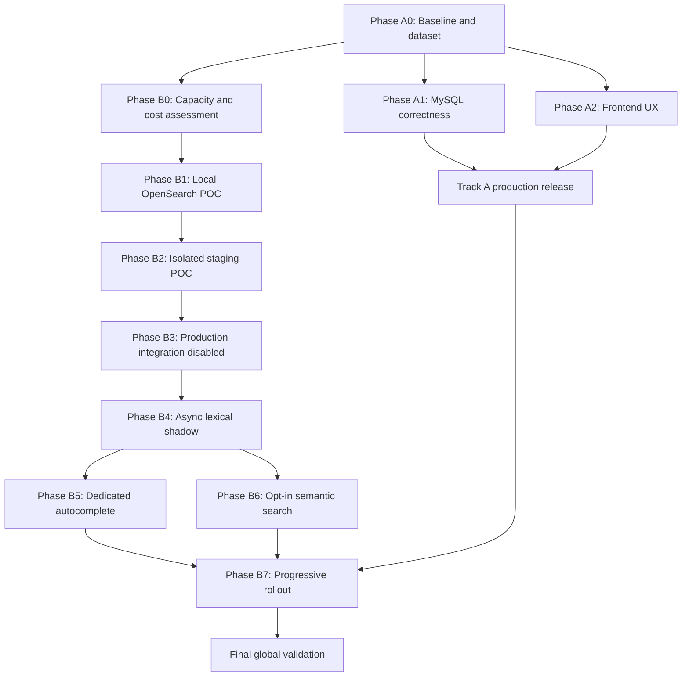

# Mayush Search Enhancement — Final Implementation-Ready Plan

## Executive decision

Mayush will use two independent delivery tracks:

- **Track A:** Immediate MySQL and frontend search improvements. This track is independently shippable and does not depend on OpenSearch.
- **Track B:** OpenSearch evaluation and eventual integration. OpenSearch remains only a candidate until infrastructure, relevance, cost, and recovery gates pass.

Current production defaults remain:

```env
SEARCH_BACKEND=mysql
OPENSEARCH_POC_ENABLED=false
OPENSEARCH_SHADOW_ENABLED=false
OPENSEARCH_PRIMARY_ENABLED=false
AI_SEARCH_ENABLED=false
```

No OpenSearch installation, production configuration change, or customer-facing activation is authorized before the proof-of-concept gates pass.

The current repository confirms that MySQL is active and no OpenSearch, Elasticsearch, Typesense, Meilisearch, Scout, or Docker Compose search service is configured. Relevant code is concentrated in [SearchController.php](C:/laragon/www/mayush/app/Http/Controllers/SearchController.php), [SemanticUtility.php](C:/laragon/www/mayush/app/Utility/SemanticUtility.php), [app.blade.php](C:/laragon/www/mayush/resources/views/frontend/layouts/app.blade.php), and the storefront/API routes.

## Mandatory delivery protocol

Every phase and implementation item must follow this sequence:

1. Inspect the existing implementation.
2. Implement locally.
3. Run focused local tests.
4. Run the complete relevant local regression suite.
5. Document local results and remaining risks.
6. Prepare production backups and exact rollback steps.
7. Deploy the smallest safe production change.
8. Validate production configuration and infrastructure.
9. Run production-safe smoke tests.
10. Monitor logs, queues, latency, errors, and business impact.
11. Keep the feature disabled or feature-flagged until production validation passes.
12. Roll back immediately if any acceptance gate fails.

Each phase report must contain:

- commit or build identifier
- changed components
- local test output
- regression test output
- configuration differences
- backup identifier
- rollback commands
- production smoke-test output
- monitoring results
- go/no-go decision
- owner and reviewer approval

## Target architecture

Create shared internal components without breaking existing endpoint contracts:

- `SearchService`: complete product search.
- `AutocompleteService`: lightweight suggestions.
- `SearchBackend`: MySQL fallback and OpenSearch adapter.
- `SearchQuery`: normalized query, locale, filters, sorting, pagination, and mode.
- `SearchResult`: products, totals, facets, suggestions, related results, backend, and telemetry.
- `SearchDocumentBuilder`: canonical product document for indexing and POC comparisons.
- `SearchNormalizationService`: shared text, Arabic, Darija, Arabizi, and identifier handling.
- `SearchVisibilityPolicy`: final shared visibility rules.
- `SearchTelemetry`: privacy-safe query and outcome events.

Existing endpoints remain available and backward-compatible:

- `/search`
- `/search-v2`
- `/ajax-search`
- `/api/v2/products/search`
- `/api/v2/get-search-suggestions`

`SearchService` must not be used as the autocomplete implementation. Both services may reuse normalization, visibility, security, caching, and telemetry components.

## Relevance and filtering policy

Structured filters must execute inside the selected backend before pagination:

- category
- brand
- price
- seller
- product type
- stock
- color
- attributes
- delivery availability
- variant constraints

MySQL hydration is only a final critical safety check for publication, seller authorization, deletion, and current source-of-truth data.

Progressive matching order:

1. Exact SKU, barcode, model, product ID, or seller reference.
2. Exact product-name match.
3. Exact phrase match.
4. All meaningful terms.
5. Configurable partial matching using `minimum_should_match`.
6. Prefix and approved synonym matching.
7. Conservative typo matching.
8. Semantic matching only in AI mode or the separate Related section.

For queries with one or two meaningful terms, require a strong match. For longer queries, initially require approximately 70% of meaningful terms plus at least one name, brand, category, or tag anchor. This percentage must be tuned using the relevance dataset, not treated as a permanent assumption.

Business signals can reorder products only inside an eligible relevance tier. They cannot make an irrelevant product eligible.

## Multilingual, Darija, and Arabizi strategy

Preserve the original query and create controlled token-level expansions.

Required handling:

- English
- French
- Arabic
- Darija in Arabic script
- Arabizi using Latin letters and digits
- mixed Arabic/French/Darija queries

Examples to test:

- `khzana`
- `5zana`
- `3oud`
- `7did`
- `table beige b taman mzyan`
- mixed Arabic and French product queries

Rules:

- Never globally replace digits.
- Protect prices, dimensions, quantities, SKUs, barcodes, and models.
- Detect Arabizi at token level.
- Expand only when confidence is high.
- Keep original, normalized, and expanded forms separate.
- Apply a maximum number of expansions per token.
- Record which expansion path produced a result for evaluation.

Arabic normalization candidates must be compared using the relevance dataset:

- exact normalized Arabic fields without stemming
- OpenSearch built-in Arabic analyzer
- custom light-stemming analyzer
- diacritic removal
- tatweel removal
- alef normalization
- yeh normalization
- ta-marbuta handling
- Arabic and Latin digit normalization

The final analyzer choice must be evidence-based.

## Relevance dataset workstream

### Ownership

- Dataset owner: Search Product Owner.
- Business reviewer: Marketplace or merchandising representative.
- Technical reviewer: Search/Backend Lead.
- Labeling QA: QA Lead.

### Sources

Use:

- anonymized production search queries, if available
- zero-result queries
- reformulated queries
- product-click and add-to-cart queries
- customer-support search failures
- seller catalog samples
- curated multilingual edge cases

### Minimum initial dataset

Create at least:

- 300 English queries
- 300 French queries
- 300 Arabic queries
- 200 Darija Arabic-script queries
- 200 Arabizi queries
- 200 mixed French/Darija/Arabic queries
- 200 identifier, dimension, currency, brand, and attribute queries
- 100 no-result and malicious-input queries

Queries may belong to multiple categories, but the dataset must record each applicable label.

### Labeling

Use:

- `0` — irrelevant
- `1` — weak or marginally related
- `2` — relevant
- `3` — highly relevant or exact target

For identifier queries, also record exact-match success separately.

Ambiguous cases require a second reviewer. Disagreements must be resolved or excluded from the scored set. Version the dataset and labeling guidelines.

Use:

- 80/20 development and holdout split
- bootstrap 95% confidence intervals for offline metrics
- minimum sample sizes per language and query class
- measurement windows of at least 7–14 days for online behavior, depending traffic volume

Do not use an arbitrary permanent 2% regression threshold. Any regression threshold must be justified by confidence intervals, sample size, and business impact.

## Track A — Immediate production improvements

Track A is independently shippable even if OpenSearch is rejected.

### Phase A0 — Baseline, telemetry, and feature flags

Implement:

- feature flags
- baseline result capture
- relevance dataset
- privacy-safe telemetry
- search error and latency instrumentation
- query-type and locale dimensions
- visibility regression fixtures

Measure:

- nDCG@10
- MRR
- search-to-product-click rate
- search-to-add-to-cart rate
- reformulation rate
- abandonment
- autocomplete acceptance
- zero-result rate
- p50/p95 latency
- error rate

Gate:

- baseline results are reproducible
- dataset ownership is assigned
- focused search tests pass
- no customer-facing behavior changes

### Phase A1 — Secure and correct MySQL fallback

Implement:

- centralized visibility enforcement
- translated product matching
- correct multi-word term grouping
- safe sort allowlists
- removal of unsafe raw SQL interpolation
- safe autocomplete rendering
- narrowed exception handling
- AI filter and visibility enforcement
- duplicate semantic/index dispatch prevention
- semantic and visual-search rate limits
- current MySQL fallback preservation

Keep MySQL ranking intentionally simple:

- exact identifiers
- exact product names
- phrase matches
- basic full-text and fallback matching
- translation-aware matching

Do not build a second advanced ranking engine in MySQL.

Gate:

- zero visibility leaks
- zero confirmed SQL injection or XSS regressions
- all existing search/API/security tests pass
- API response shapes remain compatible

### Phase A2 — Frontend search improvements

Implement independently of OpenSearch:

- debounce autocomplete requests
- cancel stale requests
- enforce minimum and maximum query length
- preserve query, locale, filters, sort, pagination, and AI state in URLs
- add keyboard navigation
- add visible focus states
- add accessible labels and live-region feedback
- support Arabic RTL
- improve mobile behavior
- improve no-result recovery
- prevent unrelated products from appearing in the main list
- keep autocomplete separate from full product search

The dedicated autocomplete index is not required for this phase. MySQL may continue serving suggestions.

Gate:

- keyboard-only navigation works
- no stale AJAX response overwrites newer results
- XSS-safe highlighting works
- mobile and RTL tests pass
- accessibility checks pass
- no-result states provide useful recovery options

### Track A production activation

Track A may be enabled independently after:

- local focused tests pass
- full relevant regression passes
- production backup and rollback steps are prepared
- production smoke tests pass
- logs, queues, latency, and business metrics remain healthy

## Track B — OpenSearch candidate evaluation and integration

### Phase B0 — Infrastructure, capacity, and cost assessment

Before installation, record:

- total and available RAM
- CPU core count and current usage
- disk capacity and expected index growth
- MySQL memory and CPU usage
- Redis memory and latency
- Horizon worker usage and queue depth
- Reverb usage
- current server load
- product, translation, seller, category, attribute, and variant counts
- expected search traffic and concurrency
- backup-storage availability
- expected OpenSearch memory, disk, and snapshot requirements
- infrastructure and operational cost

The current sandbox cannot provide authoritative production host metrics. These values must come from the staging or production host using approved operational access.

Select one architecture:

- same-server self-hosted installation
- separate self-hosted VPS
- managed OpenSearch
- remain on MySQL
- reconsider Typesense if OpenSearch fails

The previous self-hosted preference remains the default, but same-server installation is not assumed safe.

Gate:

- capacity report approved
- OpenSearch placement approved
- storage and backup plan approved
- monitoring and alerting plan approved
- failure-isolation plan approved
- cost owner approved
- no production installation yet

### Phase B1 — Local OpenSearch proof of concept

Install OpenSearch only in local development or an isolated local environment.

Validate:

- Laravel connectivity
- authentication
- TLS verification
- timeouts
- circuit breakers
- index creation
- mappings
- analyzers
- document indexing
- document updates
- document deletion
- filters
- facets
- sorting
- aliases
- full reindex
- incremental indexing
- snapshot creation
- snapshot verification
- snapshot restoration
- MySQL fallback
- English, French, Arabic, Darija, Arabizi, and mixed-language queries

Use representative anonymized data rather than a handful of manual products.

Test variant-safe nested mappings so attributes from different variants cannot be combined incorrectly.

Gate:

- local integration tests pass
- relevance improves against MySQL on the development set
- critical filters are correct
- analyzer choices are supported by data
- failure fallback works
- full and incremental indexing work
- restore completes successfully

### Phase B2 — Isolated staging proof of concept

Deploy OpenSearch to isolated staging or a temporary POC environment.

Do not route customer search traffic to it.

Validate:

- real deployment networking
- TLS and authentication
- resource limits
- service restart behavior
- persistent storage
- backup creation
- snapshot verification
- restoration
- Laravel timeout and fallback
- bulk indexing
- queue backpressure
- partial failures
- index growth
- CPU, RAM, disk, and I/O under representative load
- query latency under concurrency
- index freshness
- recovery after service failure

Run the full relevance dataset and compare:

- nDCG@10
- MRR
- exact identifier success
- zero-result rate
- locale-specific performance
- filter correctness
- facet correctness
- variant correctness
- p50/p95 latency
- indexing throughput
- operational cost

Gate:

- measurable relevance improvement
- acceptable multilingual behavior
- no visibility or filter defects
- safe Laravel fallback
- successful backup and restore
- capacity headroom approved
- operating cost approved
- ownership and on-call coverage approved

If the gate fails, remain on improved MySQL or run a separate Typesense evaluation. Do not force OpenSearch adoption.

### Phase B3 — Production lexical integration, disabled by default

Only after B2 passes:

Implement:

- direct custom OpenSearch adapter
- canonical `SearchDocumentBuilder`
- transactional outbox
- full reindex command
- incremental indexing
- aliases
- external versioning
- tombstones
- dead-letter handling
- repair jobs
- index-lag monitoring
- critical-field freshness checks
- MySQL fallback

Keep:

```env
OPENSEARCH_PRIMARY_ENABLED=false
OPENSEARCH_SHADOW_ENABLED=false
```

#### Transactional outbox

Required fields:

- `id`
- `product_id`
- `event_type`
- `operation`
- `search_version`
- `idempotency_key`
- `payload_hash`
- `status`
- `attempts`
- `available_at`
- `processed_at`
- `last_error`
- `created_at`
- `updated_at`

Operations:

- `upsert`
- `delete`

Event types may distinguish:

- publication/visibility
- seller approval or ban
- product content
- translation
- stock
- price
- promotion
- popularity

The consumer must use a monotonic per-product version. Older updates must never overwrite newer documents.

Payload strategy:

- store the product identifier and version for normal upserts
- rebuild the current canonical document from MySQL
- store tombstone information for deletes
- use `payload_hash` to detect duplicate or unchanged events
- use `idempotency_key` to prevent duplicate processing

Retention:

- retain successful events for a configurable short audit window
- retain failed and dead-letter events longer
- provide archive/prune commands
- never prune unresolved failures

#### Priority and freshness

Initial target service levels:

- publication, unpublication, seller ban, deletion: within 60 seconds
- price, stock, promotion start/end: within 2 minutes
- names, descriptions, tags, and translations: within 5 minutes
- popularity signals: within 15 minutes

Use the existing search queue first. Add separate priority queues only if measurements show that bulk work can violate critical freshness.

#### Bulk updates

For flash sales, promotions, stock changes, and seller catalog updates:

- use OpenSearch bulk requests
- chunk requests
- limit concurrent bulk jobs
- prioritize critical visibility, stock, and price events
- retry partial failures by document
- apply queue backpressure
- measure lag
- repair failed documents
- ensure promotion start and expiration events are both indexed

When OpenSearch price or stock is stale:

- do not trust it for price or stock filtering/sorting if the freshness SLA is exceeded;
- route the query to MySQL fallback;
- record the fallback reason;
- alert on repeated stale-field fallback;
- keep current MySQL data as the source of truth.

#### Scout decision

Recommended approach: direct custom OpenSearch integration.

Reason:

- Scout is not currently configured.
- Search requires facets, complex filters, nested variants, external versioning, outbox ownership, hybrid search, telemetry, and MySQL fallback.
- A custom adapter provides clearer control and avoids duplicate synchronization.

Scout may only be used if:

- a custom engine is implemented;
- Scout observers are disabled for these models;
- the transactional outbox remains the only synchronization path;
- facets, nested variants, versioning, and fallback behavior are explicitly covered.

Do not run Scout synchronization and outbox synchronization simultaneously.

### Phase B4 — Early asynchronous lexical shadow validation

Run OpenSearch shadow requests while MySQL remains customer-visible.

Rules:

- asynchronous execution
- stable user/session sampling
- no customer-response blocking
- record completed requests separately from timeouts
- record cache state
- record query type and locale
- compare only equivalent requests
- choose timeout after local and staging measurements
- keep shadow sampling initially between 5% and 10%, subject to capacity

Track:

- nDCG@10
- MRR
- result overlap
- zero-result rate
- filter correctness
- facet mismatch
- hydration rejection
- index lag
- timeout rate
- MySQL and OpenSearch latency separately
- resource impact of shadow requests

Gate:

- shadow traffic has no measurable customer latency impact
- OpenSearch relevance improves on holdout data
- no critical consistency or visibility defects
- resource usage stays within approved capacity
- rollback remains immediate

### Phase B5 — Dedicated autocomplete index

This is separate from frontend debounce work.

Implement a lightweight suggestion index containing:

- product names
- categories
- brands
- approved popular queries
- trending products
- exact SKU/model prefixes

Add:

- locale-aware fields
- safe highlighting
- deduplication
- prefix matching
- rate limits
- maximum query size
- cache controls
- stale-request cancellation
- no embedding calls per keystroke

Fallback remains available through MySQL if the suggestion index is unavailable.

Gate:

- autocomplete p95 meets the approved absolute budget
- suggestions are relevant and safe
- no visibility leakage
- no excessive request amplification
- mobile, keyboard, RTL, and accessibility tests pass

### Phase B6 — Opt-in semantic and Related results

Only after lexical search is stable.

Implement:

- multilingual embedding model validated against the dataset
- OpenSearch hybrid lexical/vector retrieval
- explicit AI opt-in
- strict primary-result relevance threshold
- separate Related section for lower-confidence semantic products
- same backend-side filters and visibility rules
- query embedding cache by normalized query, locale, and model version
- provider timeout
- circuit breaker
- rate limiting
- cost budget
- deterministic lexical fallback

Cross-language semantic matching must be evaluated separately from lexical multilingual matching.

Gate:

- AI disabled means no semantic calls
- no semantic visibility or filter bypass
- weak semantic results stay in Related
- provider failures return lexical results
- cost and latency remain within approved limits

### Phase B7 — Progressive customer rollout

Use stable bucketing:

1. internal users
2. 5%
3. 25%
4. 50%
5. 100%

Separate rollout flags for:

- OpenSearch primary
- dedicated autocomplete
- business ranking
- Related results
- semantic search

Monitor:

- relevance metrics
- search-to-click
- search-to-cart
- zero-result rate
- reformulation
- abandonment
- autocomplete acceptance
- latency
- errors
- queue failures
- OpenSearch health
- index lag
- hydration rejection
- fallback rate
- semantic cost

Promotion requires explicit owner and reviewer approval at every rollout level.

## Totals, facets, and hydration mismatch behavior

When hydration rejects an indexed product:

1. Remove it from visible results.
2. Preserve the remaining OpenSearch order.
3. Over-fetch up to three page sizes.
4. Trigger immediate repair or deletion indexing.
5. Record product ID, query type, backend, and rejection reason.
6. Record mismatch and rejection rates.
7. Alert when mismatch exceeds 1%.
8. Block promotion or roll back when mismatch exceeds 2% during the approved monitoring window.

Customer behavior:

- If the page can be refilled, display the valid products.
- If it cannot be refilled, display fewer products rather than unsafe products.
- Keep the numeric API field backward-compatible.
- Add `total_confidence` and `facet_confidence` metadata where supported.
- If confidence is low, the storefront must not describe totals as exact.
- If mismatch is persistent, route affected queries to MySQL fallback.

Do not claim exact totals or facets while hydration mismatches are above the accepted operational threshold.

## Business ranking configuration

Initial configurable signals:

- availability
- time-decayed sales velocity
- conversion confidence
- rating confidence
- freshness
- promotion score

Required configuration:

- sales lookback period
- time-decay formula
- minimum sales/click/order sample
- rating-confidence formula
- maximum individual boost
- maximum combined business boost
- promotion ceiling
- new-product treatment
- sponsored-product label and placement policy

Business ranking must never bypass:

- textual relevance
- visibility
- seller eligibility
- product filters
- variant constraints

## Local-to-production validation matrix

| Item | Local implementation | Local validation | Production preparation | Production validation | Feature flag | Rollback |
|---|---|---|---|---|---|---|
| Baseline and telemetry | Add contracts, flags, events, and dataset tooling | Focused tests, full relevant PHPUnit suite, metric fixture validation | Record current metrics and flags | Verify telemetry ingestion and no behavior change | All new flags off | Disable telemetry changes or revert release |
| MySQL correctness | Centralize visibility, translations, grouping, sort allowlists, SQL/XSS fixes | Search/security/API tests, full Laravel regression, cache checks | Database backup if migrations are added; record flags | Safe searches, hidden-product tests, logs, queues, latency | `MYSQL_IMPROVED_SEARCH` | Disable improved MySQL flag |
| Frontend UX | Debounce, cancellation, URL state, accessibility, RTL, no-result UX | Browser, build, accessibility, mobile, RTL tests | Back up frontend release and record asset version | Smoke-test search, autocomplete, mobile/RTL behavior | `SEARCH_UX_V2` | Disable UX flag or deploy previous assets |
| Capacity assessment | Produce resource and cost report | Validate calculations against staging data | Confirm host, storage, backup, and maintenance owner | Verify live resource baselines before install | None | Do not install |
| Local OpenSearch POC | Install isolated local service and adapter | Connectivity, mappings, indexing, failure, analyzer, restore, load tests | No production change | None | `OPENSEARCH_POC_ENABLED` local only | Destroy isolated POC only after evidence is archived |
| Staging POC | Deploy isolated staging service | Full relevance dataset, load, backup, restore, failure tests | Staging backup and rollback plan | Validate TLS, auth, capacity, queues, logs, and fallback | `OPENSEARCH_POC_ENABLED` staging only | Remove staging service or disable integration |
| Production lexical integration | Add adapter, outbox, aliases, jobs, repair, monitoring | PHPUnit, integration tests, migrations, queue tests, mock failure tests | DB/config backup, queue status, exact rollback | Validate service health and indexing without customer activation | `OPENSEARCH_PRIMARY_ENABLED=false` | Disable adapter and stop indexing workers if unsafe |
| Lexical shadow | Add asynchronous sampled comparison | Equivalent-request tests and sampled load tests | Record baseline, sampling, and timeout configuration | Monitor shadow impact, timeouts, resource usage, relevance | `OPENSEARCH_SHADOW_ENABLED` | Set sampling to zero |
| Autocomplete index | Build suggestion document and service | Suggestion relevance, safety, accessibility, load tests | Back up config and record fallback | Validate suggestions and fallback | `AUTOCOMPLETE_OPENSEARCH_ENABLED` | Disable dedicated suggestions |
| Semantic search | Add hybrid retrieval and opt-in mode | Provider failure, filter, cache, cost, multilingual tests | Confirm provider budget and secrets | Validate AI opt-in, latency, cost, fallback | `AI_SEARCH_ENABLED` | Disable AI immediately |
| Progressive rollout | Stable bucketing and monitoring | Flag assignment and rollback tests | Backup, flag snapshot, on-call coverage | Canary, smoke tests, logs, queues, metrics, business impact | Rollout percentage flags | Return to MySQL |
| Final global validation | Execute complete release checklist | Full tests, build, integration, load, accessibility, high-risk smoke tests | Final backup and restore confirmation | Global production smoke and monitoring review | All approved flags | Global rollback to MySQL and previous release |

## Phase dependency map



## Ownership and cost assessment

Effort bands are provisional planning estimates, not delivery-duration promises. They must be re-estimated after Phase A0.

| Phase | Owner | Reviewer | Dependencies | Initial effort range | Infrastructure/external cost | Ongoing maintenance | Monitoring | Rollback owner |
|---|---|---|---|---|---|---|---|---|
| A0 Baseline | Search Product Owner | Product + QA Lead | Query/data access | 4–8 engineer-days | Existing logs/metrics | Dataset versioning | Metric completeness | Search Lead |
| A1 MySQL | Laravel Backend Lead | Security + QA | A0 contract | 8–15 engineer-days | Existing MySQL/Redis | Query performance and regressions | Errors, latency, visibility | Backend Lead |
| A2 Frontend UX | Frontend Lead | UX + Accessibility QA | A0 telemetry | 6–12 engineer-days | Existing storefront | Browser compatibility | JS errors, AJAX latency | Frontend Lead |
| B0 Capacity | DevOps Lead | Operations Owner | A0 counts/traffic | 2–5 engineer-days | Assessment only | Capacity review | Host resources | DevOps Lead |
| B1 Local POC | Search Backend Lead | DevOps + QA | B0 assumptions | 5–10 engineer-days | Local compute only | POC cleanup | Local service health | Search Lead |
| B2 Staging POC | DevOps Lead | Operations + Security | B1 pass | 6–12 engineer-days | Staging compute/storage | Patching, backups | CPU, RAM, disk, restore | DevOps Lead |
| B3 Production integration | Backend + DevOps | Security + Operations | B2 pass | 12–22 engineer-days | OpenSearch host/storage | Indexing and queue operations | Lag, dead letters, health | Operations Owner |
| B4 Shadow | Search Lead | Product + Analytics | B3 pass | 5–10 engineer-days | Additional query load | Metric review and tuning | Timeouts, resource impact | Search Lead |
| B5 Autocomplete | Frontend + Search Lead | UX + Product | B3/B4 stable | 8–15 engineer-days | Index storage/query load | Vocabulary and suggestion quality | Acceptance, latency, errors | Frontend Lead |
| B6 Semantic | AI/Search Lead | Product + Security | Lexical stability | 8–16 engineer-days | Embedding/provider usage | Model, cost, cache maintenance | Cost, latency, quality | AI/Search Lead |
| B7 Rollout | Release Manager | Product + Operations | All approved gates | 4–8 engineer-days | Production traffic | Monitoring and incident response | Business and technical KPIs | Release Manager |
| Final validation | QA Lead | All owners | B7 stability | 5–10 engineer-days | Test/staging capacity | Regression suite maintenance | Global health review | Release Manager |

Cost decisions must be explicit:

- Track A uses existing infrastructure but may increase MySQL query, Redis cache, queue, and logging load.
- Local POC cost is developer compute only.
- Staging cost depends on selected self-hosted host, disk, and backup requirements.
- Production cost depends on same-server headroom versus separate VPS.
- Semantic search adds variable provider or embedding costs and requires a budget ceiling.
- No production cost estimate is approved until Phase B0 produces measured index size, resource, and traffic data.

## Feature-flag matrix

| Flag | Default | Owner | Dependency | Activation rule |
|---|---|---|---|---|
| `MYSQL_IMPROVED_SEARCH` | Off until Track A validation | Backend Lead | A0/A1 pass | Gradual Track A release |
| `SEARCH_UX_V2` | Off until frontend validation | Frontend Lead | A0/A2 pass | Frontend canary |
| `OPENSEARCH_POC_ENABLED` | Off in production | Search/DevOps | B0 capacity approval | Local/staging only |
| `OPENSEARCH_SHADOW_ENABLED` | Off | Search Lead | B2/B3 pass | Sampled shadow approval |
| `OPENSEARCH_PRIMARY_ENABLED` | Off | Release Manager | B4 pass | Progressive rollout |
| `AUTOCOMPLETE_OPENSEARCH_ENABLED` | Off | Search/Frontend Lead | B5 pass | Dedicated suggestion canary |
| `AI_SEARCH_ENABLED` | Off | AI/Search Lead | B6 pass | Explicit opt-in only |
| `RELATED_RESULTS_ENABLED` | Off | Product Owner | Semantic quality gate | Controlled release |
| `BUSINESS_RANKING_V2` | Off | Search Product Owner | Relevance dataset approval | Holdout validation first |

## Go/no-go gates

### Track A

Go only when:

- focused tests pass;
- complete relevant regression passes;
- API contracts are unchanged;
- security tests pass;
- local and production smoke tests pass;
- no increase in error rate or latency beyond approved budget.

### OpenSearch infrastructure

Go only when:

- capacity data is available;
- deployment location is approved;
- storage, backup, monitoring, and ownership are defined;
- failure isolation is acceptable;
- operational cost is approved.

### Local POC

Go only when:

- connectivity, mappings, filters, facets, aliases, restore, and fallback work;
- multilingual and identifier cases are tested;
- resource usage is recorded;
- relevance improvement is measurable.

### Staging POC

Go only when:

- staging capacity is representative;
- backup restoration is successful;
- failure recovery works;
- indexing and queue behavior are acceptable;
- all critical correctness gates pass.

### Production integration

Go only when:

- outbox and versioning tests pass;
- MySQL remains active;
- OpenSearch remains disabled for customers;
- rollback is executable;
- monitoring and alerts are active.

### Shadow

Go only when:

- shadow is asynchronous;
- customer response is not delayed;
- equivalent requests are compared;
- timeout and cache state are recorded;
- resource impact is acceptable.

### Primary rollout

Go only when:

- relevance metrics improve with confidence intervals;
- no locale or query class has an unjustified regression;
- no visibility/filter violations exist;
- freshness SLAs are met;
- hydration mismatches are below threshold;
- rollback is tested.

## Unresolved decisions requiring human approval

1. Dataset owner and named business reviewer.
2. Access to anonymized production query and outcome data.
3. Same-server, separate VPS, or managed OpenSearch deployment.
4. OpenSearch version, JVM/resource limits, and storage class.
5. Production backup RPO/RTO requirements.
6. Accepted OpenSearch operating-cost ceiling.
7. Final Arabic analyzer based on POC results.
8. Darija and Arabizi vocabulary owner.
9. Business-ranking boost ceilings and freshness SLAs.
10. Semantic embedding provider and maximum monthly cost.
11. Whether Typesense receives a fallback POC if OpenSearch fails.
12. Direct custom integration versus a future limited Scout adapter.
13. Production rollout and rollback owner.
14. Required on-call coverage for OpenSearch and indexing failures.
15. Numeric online experiment thresholds after baseline sample sizes are known.

## Change log from the previous plan

- Split the work into independent MySQL/frontend and OpenSearch tracks.
- Added mandatory local-first and separately validated production workflow.
- Added capacity, cost, ownership, backup, and failure-isolation assessment before installation.
- Added local and isolated staging OpenSearch POCs before production integration.
- Added explicit current-state defaults keeping MySQL active.
- Added formal relevance dataset ownership, labeling, versioning, and confidence intervals.
- Added concrete Darija and Arabizi handling without global digit replacement.
- Added Arabic analyzer comparison instead of assuming a suitable analyzer.
- Expanded the transactional outbox contract and retention policy.
- Added critical indexing freshness priorities for visibility, price, stock, and promotions.
- Added bulk promotion, stock, queue backpressure, and stale-field fallback behavior.
- Defined total, facet, hydration, and partial-page behavior.
- Added bounded business-ranking configuration.
- Separated frontend autocomplete from the later OpenSearch suggestion index.
- Replaced fixed shadow-timeout assumptions with measured timeout selection.
- Added explicit Scout ownership and duplicate-synchronization prevention.
- Added owners, reviewers, effort bands, costs, monitoring, and rollback ownership.

## Final recommendation

Begin immediately with:

- Phase A0 baseline, telemetry, relevance dataset, and feature flags.
- Phase A1 secure MySQL improvements.
- Phase A2 frontend search and autocomplete improvements against MySQL.

Do not install OpenSearch on production.

OpenSearch work must wait for:

1. infrastructure and cost assessment;
2. local proof of concept;
3. isolated staging proof of concept;
4. measured relevance and operational approval.

If OpenSearch fails the proof-of-concept gate, Mayush should continue with the independently shippable MySQL improvements and evaluate Typesense only as a separate, evidence-based alternative.

OpenSearch is not currently ready, installed, validated, or safe to activate.
